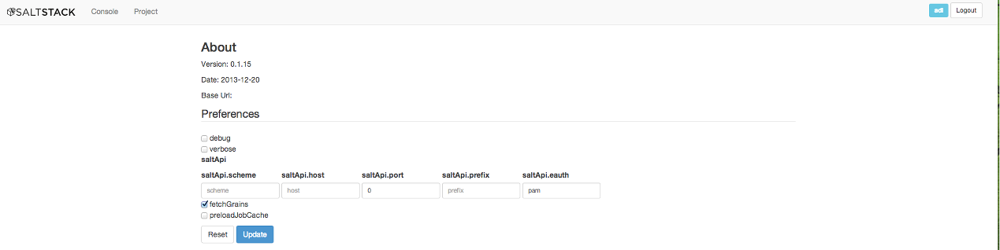
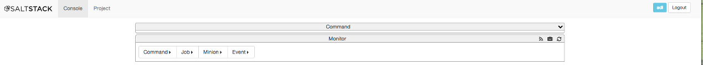
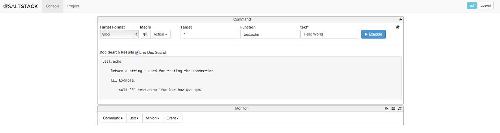
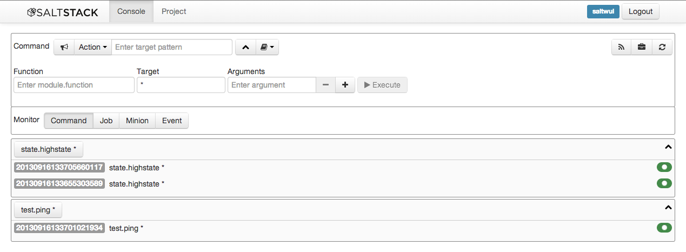
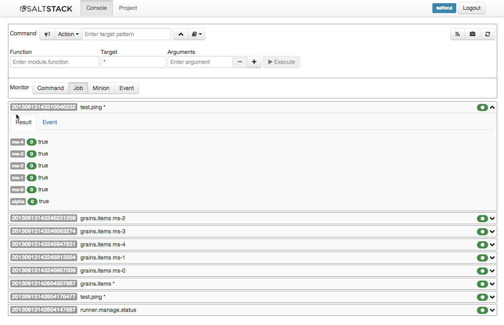
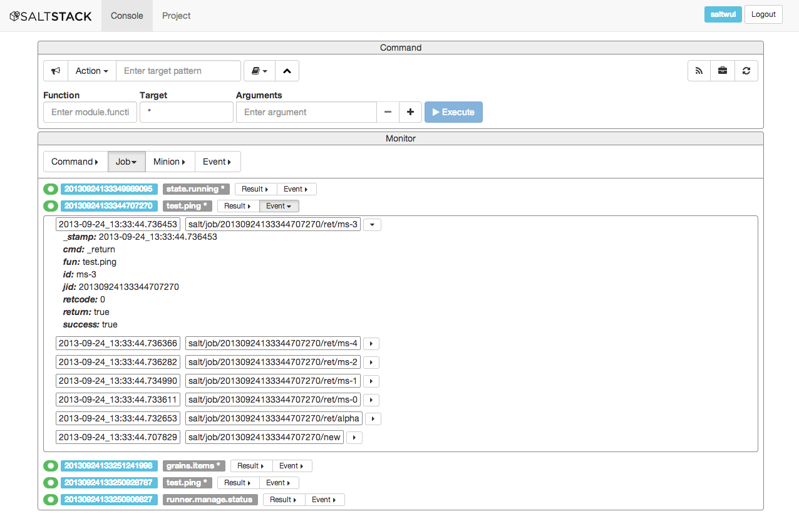
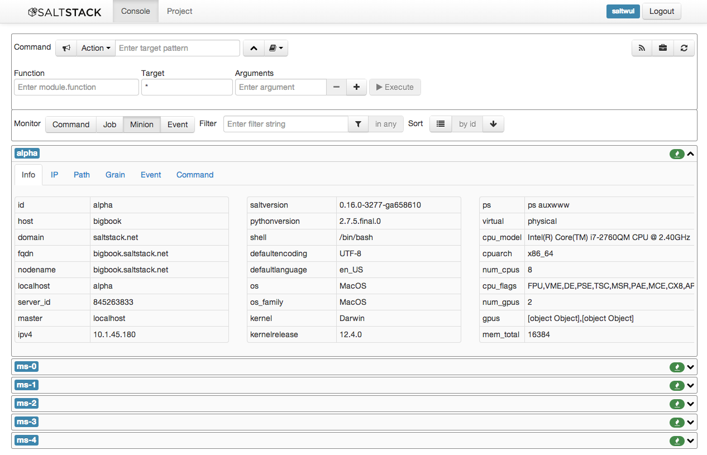
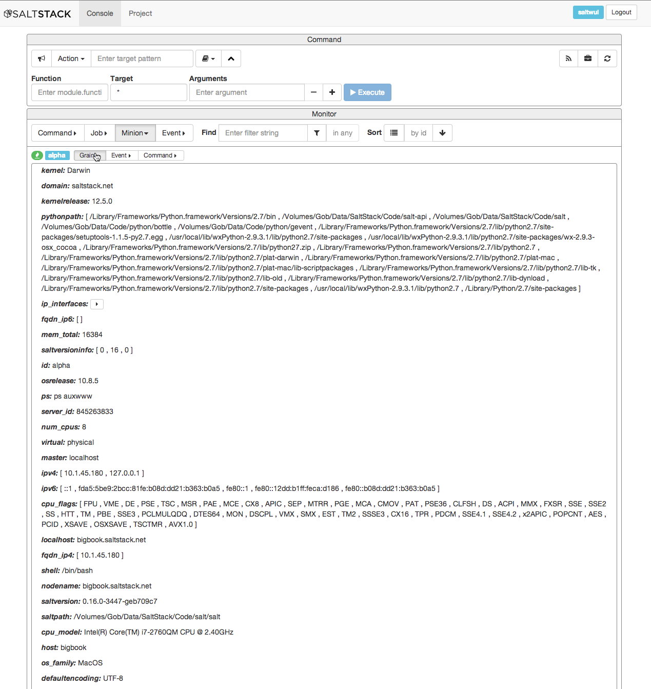
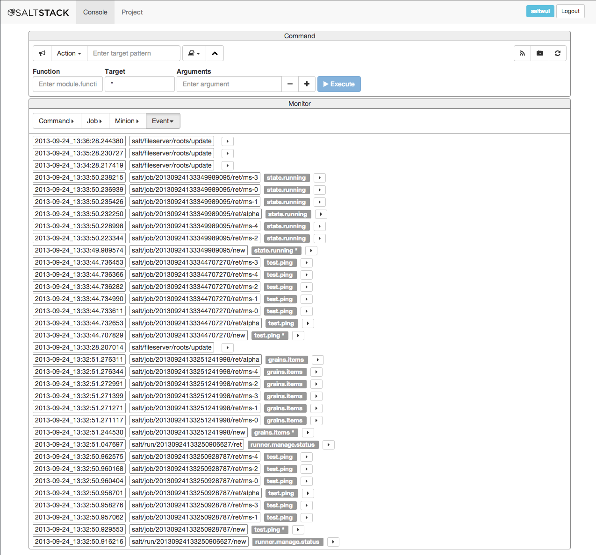
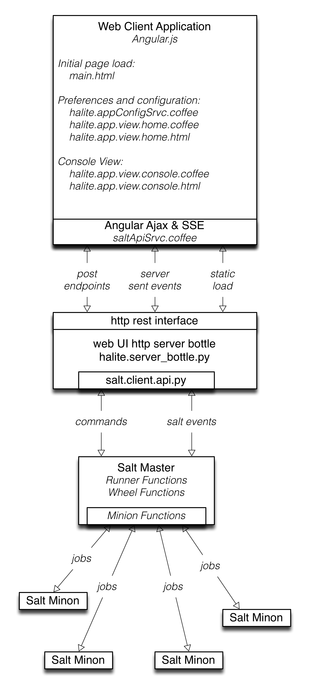

======
Halite
======

(Code-name) Halite is a Salt GUI. Status is pre-alpha. Contributions are
very welcome. Join us in #salt-devel on Freenode or on the salt-users mailing
list.

This version 0.0.3+ is substantially changed from the prior versions.
Any application based on a prior version will be broken. This version only works
with the develop branch of Salt. The changes to Salt needed to support this version
of Halite will be rolled into the upcoming 0.17 release of Salt. If one is not
comfortable working off the develop branch, please wait until the 0.17 release.

To install the develop branch of Salt:

.. code-block:: bash  

  $ git clone -b develop https://github.com/saltstack/salt.git
  $ cd salt && python setup.py install
  $ salt-master --version
  $ salt-master -l debug

This version is substantially different. Notable changes include:

* Use of a new unified api in salt/client/api.py for talking to salt.
Does not use Salt-API. The rest service is now integral to halite.

* Use of Server Sent Events (SSE) to receive realtime streaming of events 
from the Salt Event Bus.

* Use of Bottle web framework included with choice of WSGI web servers. The server must
be multithreaded or gevented or the equivalent in order to support SSE. The tested
servers are "paste", "cherrypy", and "gevent".

* Simplified web API that is a thin wrapper around salt/client/api.py.

This version of Halite is designed to work out of the box with SaltStack when 
the PyPi package version of Halite is installed. The PyPi (PIP) version of Halite 
is a minified version tailored for this purpose. (https://pypi.python.org/pypi/halite)

To pip install Halite.

.. code-block:: bash  
  
  $ pip install -U halite

This purpose of ths repository is to enable development of custom versions of the 
UI that could be deployed with different servers, different configurations, etc 
and also for development of future features for the Salt packaged version.

Installation quickstart
=======================

* Setup permissions for users who will use Halite
For example in master config:
  
.. code-block:: bash  

  external_auth:
    pam:
      myusername:
          - .*
          - '@runner'
          - '@wheel'

Halite uses the runner manage.status to get the status of minions so runner
permissions are required.  Currently halite allows but does not require any 
wheel modules.

* Clone the Halite repository::

.. code-block:: bash

  git clone https://github.com/saltstack/halite

* Run halite/halite/server_bottle.py (use with -h option to get parameters)

The simplest approach is to run the server with it dynamically generating
the main web app load page (main.html) in coffescript mode, where the coffeescript
is transpiled to javascript on the fly. In each case the appropriate server package
must be installed.
   
.. code-block:: bash
  
    $ ./server_bottle.py -d -C -l debug -s cherrypy
    
    $ ./server_bottle.py -d -C -l debug -s paste

    $ ./server_bottle.py -d -C -l debug -s gevent
    

* Navigate html5 compliant browser to http://localhost:8080/app

* Login
The default eauth method is 'pam'. To change go to the preferences page.

Documentation
=============

Preferences
-----------

The navbar has a login form. Enter the eauth username and password to login to salt.

Once logged in, the navbar will display the username hilited in blue and a logout button.
To logout click on the logout button.

Click on the SaltStack logo to go to the preferences page

On this page one can change the eauth method to something other than 'pam' such
as 'ldap'.
Enter the new eauth method string into the field saltApi.eauth and hit update.
Now refresh the browser page and the new eauth method will be enabled. Login.
  
Commands
----------

To navigate to the console view click on the 'console' tab. 

The top section of the Console view has controls for entering basic salt commands.
The target field will target minions with the command selected. There is ping button
with the bullhorn icon and the action menu has some preselected common commands.

Expanded Commands
-----------------

Click on the downward chevron button to expand the command form with additional
fields for entering any salt module function. To enter "runner" functions prepend
"runner." to the function name. For example, "runner.manage.status". To enter wheel
functions prepend "wheel." to the wheel function name. For example, "wheel.config.values".
For commands that require arguments enter them in the arguments fiels. Click the "plus"
button to add addition arguments.
Click on the Execute button or press the Return key to execute the command.

Monitors
---------
 
The bottom section of the console view has monitor view buttons. Each button will
show panels with the associated information.

* Command Monitor

Shows panels, one per command that has been executed by this user on this console. 
Clicking on the dropdown button will show the associated job ids that have been 
run with this command and the  completion status via an icon. 
Red is fail, Green is success.
Clicking on the button on the panel will rerun the command.
  

  
* Job Monitor

Shows panels, one per job that has been run by any minion associated with this
master. Clicking on the associated dropdown button with expand to show Result and Event data.
Selecting the result button will show the returner and return data
for each minion targeted by the job.
  

Selecting the Event button will show the events associated with the job.
  

  
* Minion Monitor

Shows panels, one per minion that have keys associated with this master. The minion
panels have icons to show the up/down status of the minion and the grains status.
Selecting dropdown buttons will show grains data as well as minion (not job) generated events.
  

With the grains button selected one can see all the grains for the minion.

  
* Event Monitor

Shows panels, one per event associated with this Master.
  

  
More Details comming. TBD

Browser requirements
--------------------

Support for ES5 and HTML5 is required. This means any modern browser or IE10+.

Server requirements
-------------------

* The static media for this app is server-agnostic and may be served from any
  web server at a configurable URL prefix.
* This app uses the HTML5 history API.

Libraries used
--------------

Client side web application requirements:

* AngularJS framework (http://angularjs.org/)
* Bootstrap layout CSS (http://twbs.github.io/bootstrap/)
* AngularUI framework (http://angular-ui.github.io/)
* Underscore JS module (http://underscorejs.org/‎)
* Underscore string JS module (http://epeli.github.io/underscore.string/)
* Font Awesome Bootstrap Icon Fonts  (http://fortawesome.github.io/Font-Awesome/)
* CoffeeScript Python/Ruby like javascript transpiler (http://coffeescript.org/)
* Karma Test Runner (http://karma-runner.github.io/0.8/index.html)
* Jasmine unit test framework (http://pivotal.github.io/jasmine/)

Optional dependencies: 

* Cherrypy web server (http://http://www.cherrypy.org/)
* Paste web server (http://pythonpaste.org/)
* Gevent web server(http://www.gevent.org/)

For nodejs testing:

* Express javascript web server

Deployment
-------------

There are two approaches to deploying Halite. 

1) Use it from Salt. 
The 0.17 release of salt will run halite automatically if the Halite package is
installed. So for example after installing SaltStack one can install the Halite
python package with

.. code-block:: bash

  $ pip install -U halite
  
Configure the master config for halite as follows.

.. code-block:: bash

  halite:
      level: 'debug'
      server: 'cherrypy'
      host: '0.0.0.0'
      port: '8080'
      cors: False
      tls: True
      certpath: '/etc/pki/tls/certs/localhost.crt'
      keypath: '/etc/pki/tls/certs/localhost.key'
      pempath: '/etc/pki/tls/certs/localhost.pem'
      
The "cherrypy" and "gevent" servers require the certpath and keypath files to run tls/ssl.
The .crt file holds the public cert and the .key file holds the private key. Whereas
the "paste" server requires a single .pem file that contains both the cert and key.
This can be created simply by concatenating the .crt and .key files.

If you want to use a self signed cert you can create one using the Salt .tls module

.. code-block:: bash

  salt '*' tls.create_ca_signed_cert test localhost
  
When using self signed certs, browsers will need approval before accepting the cert.
If the web application page has been cached with a non https version of the app then
the browser cache will have to be cleared before it will recognize and prompt to
accept the self signed certificate.

You will also need to configure the eauth method to be used by users of the WUI. 
See quickstart above for an example.

Install the appropriate http wsgi server selected in the master config above. In
this case its "cherrypy". The other tested servers are "paste" and "gevent". The server
must be multi-threaded, asynchronous, or multi-processing in order to support
the Server Sent Event streaming connnection used by the WUI.

Restart the SaltStack Master and navigate your html5 compliant browser to 
https://localhost:8080/app or however you have configured your master above.

If you have problems look for "Halite:" in the saltstack master log output.

2) Customized Deployment

The Halite github repository provides a skeleton framework for building your own custom
deployment. One can run the default bottle.py framwork form the command line thusly

.. code-block:: bash

  $ ./server_bottly.py -g 
  $ ./server_bottle.py -s cherrypy
  
 
or from a python application

.. code-block:: python

  import halite
  
  halite.start()

The full set of options is given by

.. code-block:: bash

  $ ./server_bottle.py -h
  usage: server_bottle.py [-h] [-l {info,debug,critical,warning,error}]
                        [-s SERVER] [-a HOST] [-p PORT] [-b BASE] [-x] [-t]
                        [-c CERT] [-k KEY] [-e PEM] [-g] [-f LOAD] [-C] [-d]

  Runs localhost web application wsgi service on given host address and port.
  Default host:port is 0.0.0.0:8080. (0.0.0.0 is any interface on localhost)
  
  optional arguments:
    -h, --help            show this help message and exit
    -l {info,debug,critical,warning,error}, --level {info,debug,critical,warning,error}
                          Logging level.
    -s SERVER, --server SERVER
                          Web application WSGI server type.
    -a HOST, --host HOST  Web application WSGI server ip host address.
    -p PORT, --port PORT  Web application WSGI server ip port.
    -b BASE, --base BASE  Base Url path prefix for client side web application.
    -x, --cors            Enable CORS Cross Origin Resource Sharing on server.
    -t, --tls             Use TLS/SSL (https).
    -c CERT, --cert CERT  File path to tls/ssl cacert certificate file.
    -k KEY, --key KEY     File path to tls/ssl private key file.
    -e PEM, --pem PEM     File path to tls/ssl pem file with both cert and key.
    -g, --gen             Generate web app load file. Default is 'app/main.html'
                          or if provided the file specified by -f option.
    -f LOAD, --load LOAD  Filepath to save generated web app load file upon -g
                          option.
    -C, --coffee          Upon -g option generate to load coffeescript.
    -d, --devel           Development mode.

The http server provides two functions.

1) Provide content delivery network for the base load of the web application static
content such as html and javascript files.

2) Provide dynamic rest api interface to salt/client/api.py module that is used by
the web application via ajax and SSE connections. Because SSE and CORS 
(Cross Origin Resource Sharing is not univesally supported even among HTML5 compliant
browsers, a single server serves both the static content and the rest API). 
An alternative approach would be to to use a web socket to stream the events. 
This would not require CORS. This may bea future option for Halite.

To deploy with apache, modify server_bottle.startServer so it creates the app but
does not call bottle.run on it but returns it to MOD_WSGI. 
See (http://bottlepy.org/docs/dev/deployment.html) for other details in using bottle.py
with Apache and Mod_wsgi.

To do a custom deployment with some other framework like Django etc. would involve
replicating the endpoints from server_bottle. 

Architecture
-------------

The following diagram illustrates how the various pieces to Halite interact.

Testing
-------

To run the karma jasmine unit test runner

.. code-block:: bash

  $ cd halite
  $ karma start karma_unit.conf.js

To run the karma angular scenario e2e test runner first start up a web server.
A multithreaded or asynchronous one will be needed if more than one browser is
tested at once.

.. code-block:: bash

  $ cd halite
  $ karma start karma_e2e.conf.js

.. ............................................................................

.. _`halite`: https://github.com/saltstack/halite
