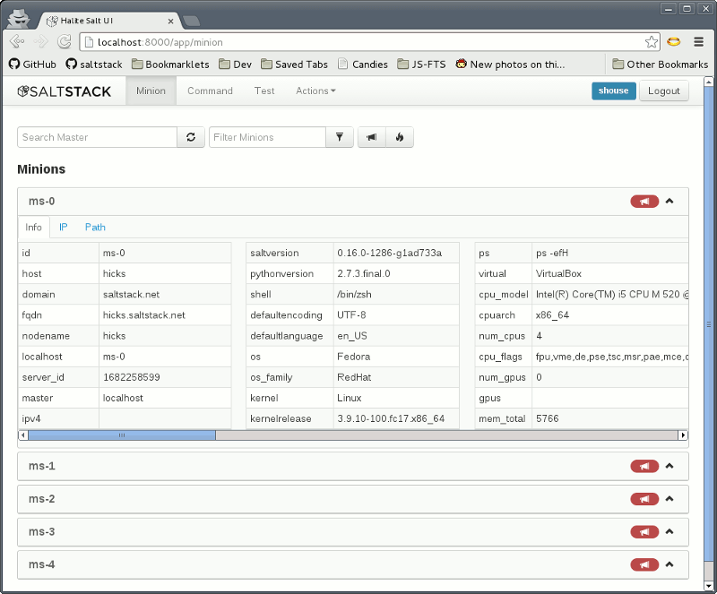

======
Halite
======

(Code-name) Halite is a Salt GUI. Status is pre-alpha. Contributions are
very welcome. Join us in #salt-devel on Freenode or on the salt-users mailing
list.

Installation quickstart
=======================

1.  Clone the Halite repository::

        git clone https://github.com/saltstack/halite

2.  Generate an ``index.html`` file::

        cd halite/halite
        ./genindex.py -C

3.  Install `salt-api`_ 0.8.2 or greater.
4.  Follow the instructions for installing CherryPy and configuring the
    `rest_cherrypy`_ module.
5.  Configure the ``app`` and ``static`` settings to point at the files in your
    halite clone. For example::

        rest_cherrypy:
          port: 8000
          debug: True
          static: /path/to/halite/halite
          app: /path/to/halite/halite/index.html

    .. note::

        The above configuration is for local use only and does not use HTTPS.
        Your Salt authentication credentials will be sent in the clear.

        Follow the `rest_cherrypy`_ module installation instructions to disable
        ``debug`` and generate self-signed SSL certiifcates, or use existing
        SSL certificates, for non-local usage.

6.  Start ``salt-api``::

        salt-api

7.  Open a browser and navigate to http://localhost:8000/app (substitute
    whatever ``port`` and ``app`` prefix you configured).

Documentation
=============

Browser requirements
--------------------

Support for ES5 and HTML5 is required. This means any modern browser or IE9+.

Server requirements
-------------------

* This app requires the `rest_cherrypy`_ module in ``salt-api`` to
  communicate with a running Salt installation via a REST API.
* The static media for this app is server-agnostic and may be served from any
  web server at a configurable URL prefix.
* This app uses the HTML5 history API and so the ``index.html`` should
  should be served from a base URL that otherwise ignores the rest of the URL
  path. In other words, if the base URL that serves the ``index.html`` file
  is ``/app``, then ``/app/some/path`` should also serve that same file.

Libraries used
--------------

Client side web application requirements:

* AngularJS framework (http://angularjs.org/)
* Twitter Bootstrap Layout CSS (http://twitter.github.io/bootstrap/)
* AngularUI framework (http://angular-ui.github.io/)
* Karma Test Runner (http://karma-runner.github.io/0.8/index.html)
* Jasmine unit test framework (http://pivotal.github.io/jasmine/)
* CoffeeScript Python/Ruby like javascript transpiler
  (http://coffeescript.org/)
* Express javascript web server
* Less CSS compiler

``genindex.py``
---------------

The ``halite/genindex.py`` script is used to generate an HTML file that will
bootstrap the app containing configurable paths to all required static JS/CSS
assets. See the output of ``genindex.py --help`` for available options.

.. note:: Updating your halite clone

    ``genindex.py`` should be run and the ``index.html`` file regnerated any
    time any static assets are added or removed.

For development ``genindex.py -C`` will build the ``index.html`` file
referencing the ``.coffee`` files which will be transpiled directly by the
browser.

For production builds, JavaScript files should first be generated via ``coffee
-c halite/app``, then ``genindex.py`` will produce a production-ready build of
``index.html``.

Testing
-------

To run the karma jasmine unit test runner

.. code-block:: bash

  $ cd halite
  $ karma start karma_unit.conf.js

To run the karma angular scenario e2e test runner first start up a web server.
A multithreaded or asynchronous one will be needed if more than one browser is
tested at once.

.. code-block:: bash

  $ cd halite
  $ karma start karma_e2e.conf.js

.. ............................................................................

.. _`halite`: https://github.com/saltstack/halite
.. _`salt-api`: https://github.com/saltstack/salt-api
.. _`rest_cherrypy`: http://salt-api.readthedocs.org/en/latest/ref/netapis/all/saltapi.netapi.rest_cherrypy.html
